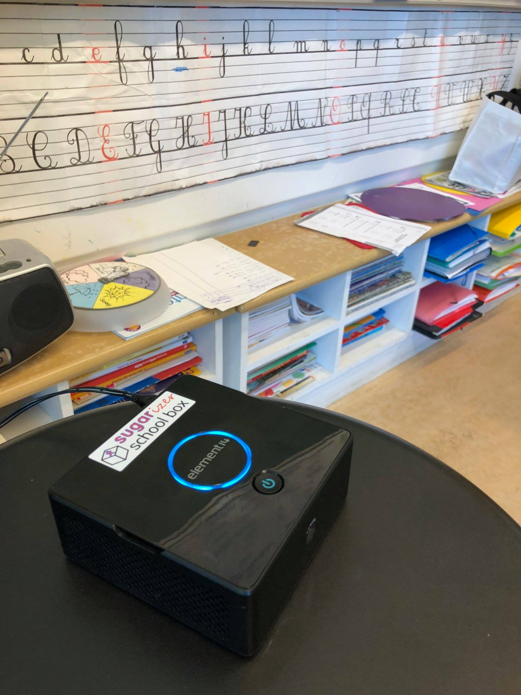
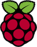

# Sugarizer School Box

Sugarizer School Box is a packaged image of [Sugarizer Server](https://github.com/llaske/sugarizer-server) for the Raspberry Pi. This script allow to create a bootable image of Raspbian with a ready to use Sugarizer Server installed. 

 

## Introduction
This script is a fork of [rpi23-gen-image script](https://github.com/drtyhlpr/rpi23-gen-image). We have customized it accordingly to make a Sugarizer Client
and Sugarizer Server ready raspbian image for Raspberry Pi 3 (should work too on Raspberry Pi 2).

This script should be launched on a [Debian Linux](https://www.debian.org/) Jessie or Stretch. First ensure that [nodejs](https://nodejs.org) is installed on your machine. If not, follow instruction [here](https://nodejs.org/en/download/package-manager/#debian-and-ubuntu-based-linux-distributions) to install it.

If you've not the time/knowledge to package yourself the image, you could **[download a ready to flash image](#download-latest-image)** below.

## Creating the image 

```shell
git clone https://github.com/amanharitsh123/sugarizer-school-box.git
cd sugarizer-school-box
sudo sh run.sh
```

At the of end of the script - depending of your network and your CPU, the script could take about 45mn to run - this message should be displayed:

`<fullpath-of-image> (<size-of-image>M) : successfully created`

## Flashing the image

The resulting of the script should be a file named:

`xxxx-xx-xx-arm64-rpi-4.11.y-rpi3-stretch-arm64.img`

located into `images/stretch` directory.

Once the image is generated you could flash it on a SD card that you will insert directly into your Raspberry PI.

To do that, on Debian just launch:

```shell
bmaptool copy ./images/stretch/*.img /dev/mmcblk0
```

Note: You have to find your sdcard's mount point and replace it with "mmcblk0" while flashing.

On Windows and MacOS users, retrieve the img file on your drive and use [Etcher](https://etcher.io/) to flash the file into a SD card.

## Using the image

At first boot, the server will proceed to settings. It will take 30-35mins approx for the setting server up. During this time, make sure that your Raspberry Pi has a working ethernet connection. Docker images will be loaded and containers will be made, followed by network setup. 

Raspberry Pi will reboot as soon as the setup is done, now you can connect to the WiFi. Default ssid for the WiFi is "SugarizerSchoolBox" and password is "sugarizer". These can be changed in image_scripts/hotspot.sh by changing $ssid and $pass variables.

After connected to the WiFi, sugarizer will be accessible at 10.0.0.1, try.sugarizer.org, server.sugarizer.org, sugarizer.org. 

## Download latest image
Download latest image [here](http://sugarizer.org/download/2018-07-25-arm64-rpi-4.11.y-rpi3-stretch-arm64.img) (will be updated soon).

## More information
For more information, see [Amanharitsh123](https://wiki.sugarlabs.org/go/User:Amanharitsh123) page on SugarLabs wiki.

